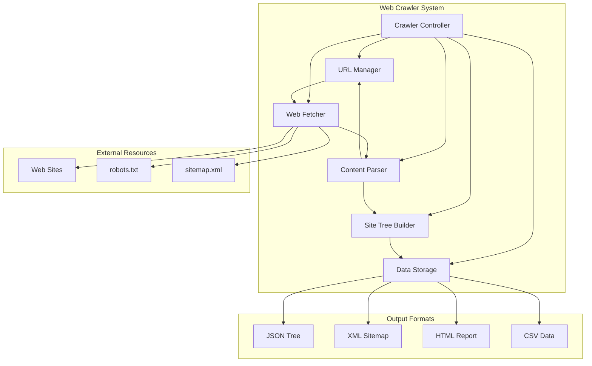
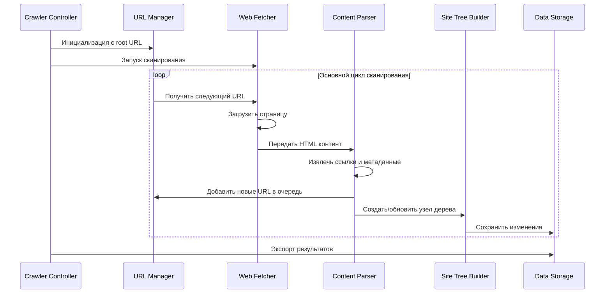
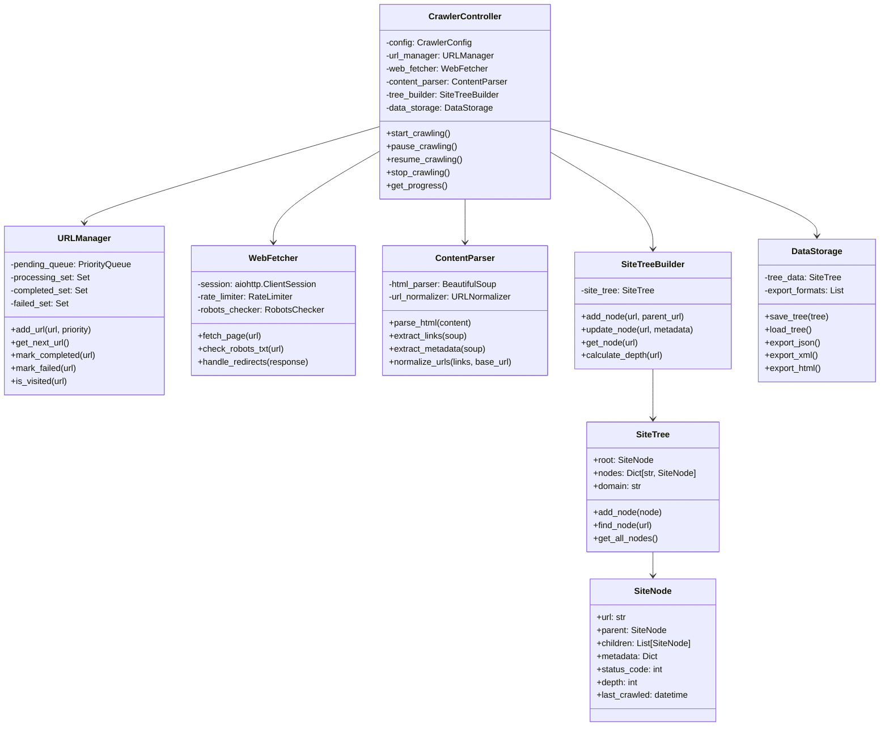
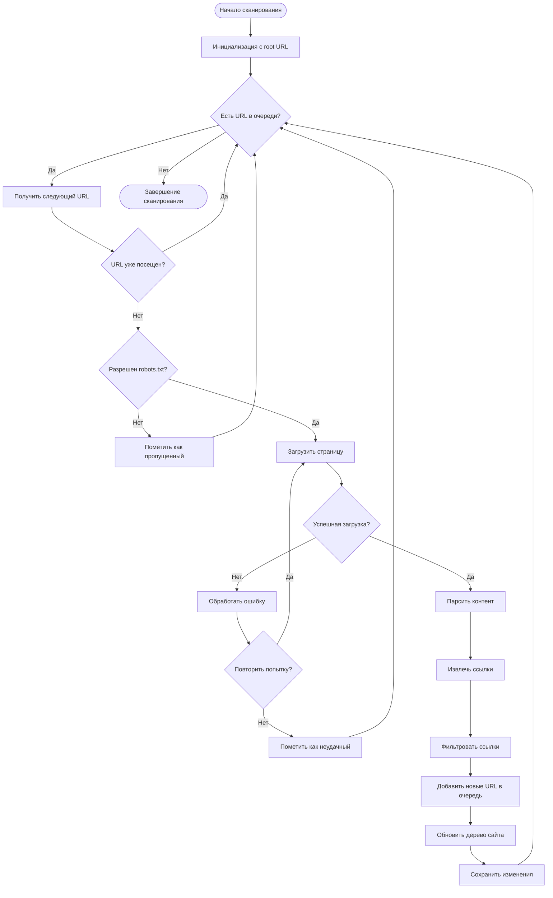
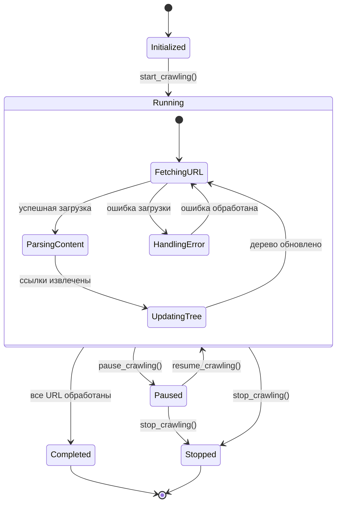

# Диаграмма архитектуры веб-краулера

## Общая архитектура системы



## Поток данных в системе



## Структура классов



## Алгоритм обхода URL



## Система управления состоянием



## Архитектура хранения данных

```mermaid
erDiagram
    SITE_TREE {
        string root_url
        string domain
        datetime created_at
        datetime updated_at
        int total_nodes
        int max_depth
    }
    
    SITE_NODE {
        string url PK
        string parent_url FK
        int depth
        int status_code
        string content_type
        datetime last_crawled
        boolean is_external
        text title
        text description
        json metadata
    }
    
    URL_QUEUE {
        string url PK
        int priority
        string status
        datetime added_at
        int retry_count
        datetime next_retry
    }
    
    CRAWL_LOG {
        int id PK
        string url FK
        datetime timestamp
        string action
        string status
        text error_message
        float response_time
    }
    
    SITE_TREE ||--o{ SITE_NODE : contains
    SITE_NODE ||--o{ SITE_NODE : parent_child
    URL_QUEUE ||--o{ CRAWL_LOG : logs
    SITE_NODE ||--o{ CRAWL_LOG : logs